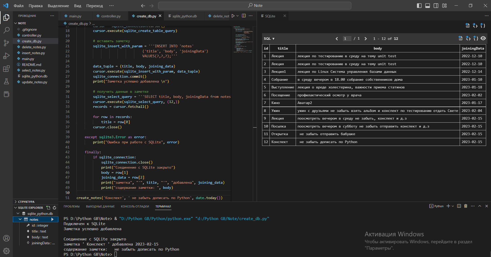
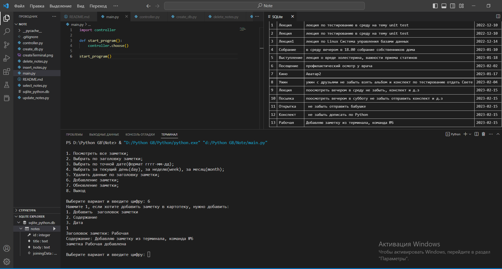
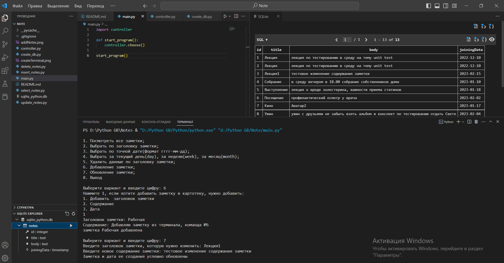
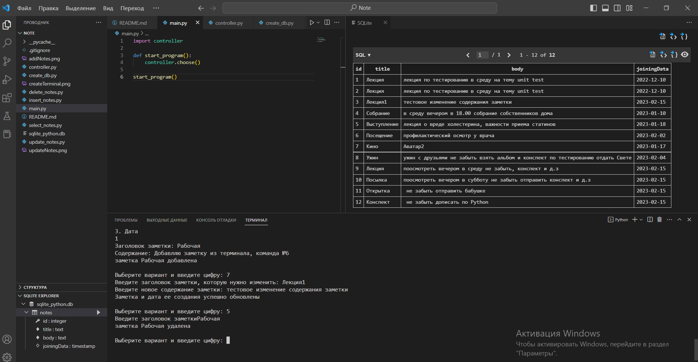
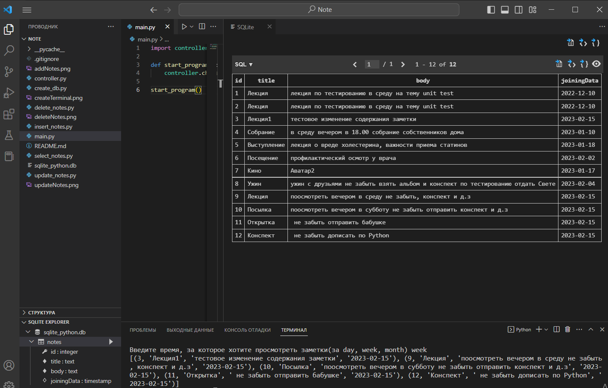

## Приложение заметки (Python)

Простое консольное приложение заметки(Notes) для формирования и хранения заметок.

Возможности у приложения будут следующими:

1. Создание заметки.
2. Хранение заметок.
3. Удаление заметки.
4. Добавление заметок.
5. Редактирование заметок.

Приложение написано на Python.

# Описание

Мною использована SQLite — компактная встраиваемая СУБД. SQLite не является отдельно работающим процессом, с которым взаимодействует программа, а представляет собой библиотеку, с которой программа компонуется. Таким образом, в качестве протокола обмена используются вызовы функций (API) библиотеки SQLite. SQLite хранит всю базу данных (таблицы) в единственном стандартном файле на том компьютере, на котором исполняется программа.

Для работы с SQLite я установила `Extension: SQLite` и

```python 
import sqlite3
```

# Создала БД

```python 
import sqlite3, datetime
from datetime import date

def create_notes(title, body, joining_data):
    try:
        sqlite_connection = sqlite3.connect('sqlite_python.db')
        cursor = sqlite_connection.cursor()
        print("Подключен к SQLite")

        sqlite_create_table_query = '''CREATE TABLE IF NOT EXISTS notes(
                                        id integer PRIMARY KEY AUTOINCREMENT,
                                        title text NOT NULL,
                                        body text NOT NULL,
                                        joiningData timestamp);'''


        cursor = sqlite_connection.cursor()
        cursor.execute(sqlite_create_table_query)

        # вставить заметку
        sqlite_insert_with_param = '''INSERT INTO 'notes'
                                ('title', 'body', 'joiningData')
                                VALUES(?,?,?);'''

        data_tuple = (title, body, joining_data)
        cursor.execute(sqlite_insert_with_param, data_tuple)  
        sqlite_connection.commit()
        print("Заметка успешно добавлена \n")   
        
        # получить данные в заметке
        sqlite_select_query = '''SELECT title, body, joiningData from notes WHERE id = ?'''
        cursor.execute(sqlite_select_query, (4,))
        records = cursor.fetchall()

        for row in records:
            title = row[0]
        cursor.close() 
         
    except sqlite3.Error as error:
        print("Ошибка при работе с SQLite", error)   

    finally:
        if sqlite_connection:
            sqlite_connection.close()
            print("Соединение с SQLite закрыто")                 
            body = row[1] 
            joining_data = row[2]
            print("заметка", "'", title, "'", "добавлена", joining_data)
            print("содержание заметки: ", body)  

create_notes('Конспект', ' не забыть дописать по Python', date.today())

```
Результат терминал:



У приложения реализованы методы
- `add_new_notes` 
- `update_multiple_columns`
- `del_notes`
- `select`

Метод `add_new_notes` создает новую заметку в БД `'sqlite_python.db'`.

Результат терминал:



Метод `update_multiple_columns` редактирования заметки, название которой передано в качестве аргумента, при этом обновляется содержимое и дата создания заметки.

Результат терминал:



Метод `del_notes` удаляет заметку, название которой передано в качестве аргумента.

Результат терминал:



Метод `select` выводит для чтения список заметок. при этом есть вариации просмотра списка: 

`select_all` вывести весь список

`select_time` по конкретной дате

`select_title` вывести по заголовку

`select_time2` вывести заметки за день, месяц или неделю

Результат терминал (вывести заметки за неделю, должно быть 5 заметок, так и есть)



Также есть возможность хранения информации в файле формата `.json (Untitled-1.json)`

Точка входа в программу модуль `main.py`